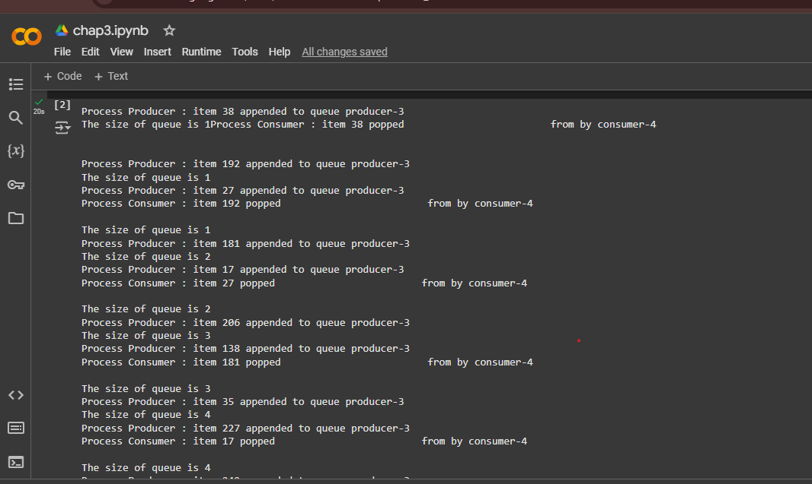

### Purpose of the Code

This code demonstrates inter-process communication (IPC) using pipes within Python's `multiprocessing` module.

#### Pipes
The `multiprocessing.Pipe` function establishes a two-way communication channel between two processes.

#### Process 1 - `create_items`
- Generates numbers from 0 to 9.
- Sends each number to the output pipe using `output_pipe.send(item)`.

#### Process 2 - `multiply_items`
- Reads numbers from the input pipe.
- Squares each number and sends the squared result to the output pipe.

#### Pipe Closing
The main process properly closes the unused ends of the pipes with `pipe_1[0].close()` and `pipe_2[0].close()` to avoid deadlocks.

#### Infinite Loop with try-except
The main process continuously reads from the pipe until it encounters an `EOFError`, which indicates that the pipe has been closed.

#### Parallelism
Two processes, `create_items` and `multiply_items`, operate in parallel, enhancing task separation.

#### Pipe Communication
- Process 1 sends data to `pipe_1`.
- Process 2 reads from `pipe_1`, processes the data, and writes the results to `pipe_2`.

#### Output
The squared values of numbers from 0 to 9 are printed in the main process.

#### End of Program
The program concludes by printing "End" when no more data is received (upon encountering `EOFError`).

### COMMUNICATING WITH QUEUE:

This code addresses the Producer-Consumer Problem using Python's `multiprocessing` module.

### Producer Class
- Generates 10 random integers within the range of 0 to 256 and adds them to a shared queue.
- Prints each item added along with the current size of the queue, simulating a delay of one second with `time.sleep(1)`.

### Consumer Class
- Continuously retrieves items from the queue until it is empty.
- Prints each item removed and pauses briefly for processing.

### Main Process
- Creates and initiates both Producer and Consumer processes.
- Waits for both processes to finish using the `join()` method.

### Output
The producer adds items to the queue while the consumer removes them, demonstrating inter-process communication through the shared queue.

### DOREM 
This code illustrates the use of daemon and non-daemon processes in Python's `multiprocessing` module.

### Daemon Process
- **`background_process`**: Operates in the background and terminates immediately when the main program exits.

### Non-Daemon Process
- **`non_background_process`**: Functions independently and completes its task even after the main program has exited.

### Execution
- The function `foo` prints messages for each process.
- The `background_process` starts but stops after a delay of two seconds when the main program ends.
- Conversely, the `non_background_process` continues running until it finishes, ensuring that its loop completes.

### KILLING PROCESS
This code showcases process lifecycle management using Python's `multiprocessing` module, focusing on starting, terminating, and joining a process.

### Functionality
It illustrates the stages of a process's lifecycle: start, terminate, and join.

### Process Lifecycle
- **Before Execution**: The process is created, and `is_alive()` returns `False`.
- **Start**: The process begins execution, changing `is_alive()` to `True`.
- **Terminate**: The process is forcibly stopped, resulting in `is_alive()` returning `False` again.
- **Join**: This step ensures that the process is properly cleaned up before the program continues.

### Exit Code
- **None**: Indicates that the process has not yet exited.
- **-15**: Indicates that the process was terminated.

### Output
The output confirms the state of the process at each stage. Only a portion of the `foo` function executes before the process is terminated.

### MYFUNC
The Python function myFunc performs a straightforward operation, printing messages based on the input parameter i. Here's a summary:

Function Details:
Input Parameter:

i (integer): Specifies the process identifier (used in messages) and the range of numbers to iterate through.
Function Behavior:

Displays the process number with the message: "calling myFunc from process n°: %s" % i.
Iterates through numbers from 0 to i-1 and prints: "output from myFunc is :%s" % j.
Return Value:

The function does not explicitly return any value. The return statement is optional and may be omitted.

### NAMING PROCESS
### Function `myFunc`
- Prints the name of the current process.
- Sleeps for 3 seconds to simulate a task.
- Exits and prints the process name again.

### Processes
- **`process_with_name`**: A custom-named process, labeled 'myFunc process'.
- **`process_with_default_name`**: Uses the default naming convention for processes (e.g., Process-1).

### Process Lifecycle
- Both processes are initiated using the `start()` method.
- The `join()` method ensures that the main program waits for both processes to complete.

### Output
The name of each process is printed upon starting and exiting. The processes run concurrently.

### PROCESS IN SUBCLASS
### Custom Process Class
- **`MyProcess`**: Inherits from `multiprocessing.Process`.
- The `run` method is overridden to print the name of the process.

### Process Creation and Execution
- In a loop, 10 instances of `MyProcess` are created.
- Each process is started with `process.start()` and the main program waits for it to finish using `process.join()`.

### Process Lifecycle
- **`start()`**: Initiates the process, executing the `run` method.
- **`join()`**: Ensures the main program waits for the process to complete before proceeding to the next iteration.

### Output
For each iteration, the message 'called run method in Process-X' is printed, where X represents the process number (e.g., Process-1, Process-2, etc.).

### PROCESS POOL
### Function `function_square`
- Takes an input value and returns its square.

### Process Pool
- A `multiprocessing.Pool` is created with 4 worker processes.
- The `pool.map(function_square, inputs)` method applies the `function_square` function to each element in the `inputs` list, returning the results in a new list.

### Process Pool Management
- **`pool.close()`**: Closes the pool to prevent any further tasks from being added.
- **`pool.join()`**: Waits for all worker processes to complete their tasks.

### Inputs and Outputs
- The `inputs` list contains numbers from 0 to 99.
- The squares of these numbers are calculated and stored as `pool_outputs`.

### Output
The program outputs the squares of numbers from 0 to 99, computed by 4 parallel processes.

### PROCESS BARRIER
### Functions
- **`test_with_barrier(synchronizer, serializer)`**: Utilizes a `Barrier` to synchronize two processes (p1 and p2), ensuring they wait for each other before proceeding. It employs a `Lock` (serializer) to guarantee mutual exclusion when printing timestamps.
- **`test_without_barrier()`**: Prints the current timestamp without any synchronization, allowing the processes to run independently.

### Processes
- **`test_with_barrier`**: Involves two processes (p1 and p2) that are synchronized using the `Barrier`, so they wait for each other before printing their timestamps.
- **`test_without_barrier`**: Involves two independent processes (p3 and p4) that print their timestamps without synchronization.

### Synchronization
- **`Barrier(2)`**: Ensures that two processes wait for one another before continuing.
- **`Lock()`**: Used to control access to the print statement, ensuring that only one process prints at a time.

### Execution
- Processes are created using the `Process` class and started with the `start()` method.
- Since the `Barrier` is set for two processes, p1 and p2 will synchronize, while p3 and p4 will operate concurrently without waiting for one another.

### Output
The processes p1 and p2 will print their timestamps simultaneously after synchronizing at the barrier, while p3 and p4 will print independently without any coordination.

### RUN BACKGROUND PROCESS NO DAEMONS
### Function `foo`
- Each process begins by printing its start message.
- If the process is named 'background_process', it loops from 0 to 4, printing those numbers.
- For the 'NO_background_process', it loops from 5 to 9, printing those numbers.
- After the loop, each process sleeps for 1 second and then prints its exit message.

### Processes
- **`background_process`**: This process is named 'background_process' and executes the loop for numbers 0 to 4.
- **`NO_background_process`**: This process is named 'NO_background_process' and executes the loop for numbers 5 to 9.

### Daemon Flag
Both processes have their daemon attribute set to False, which means the main program will wait for them to complete before exiting.

### Process Execution
- Both processes are started using the `start()` method and will run concurrently.
- They will print their respective number ranges (0-4 and 5-9) along with their start and exit messages.

### RUN BACKGROUND PROCESSES
### Function `foo`
- Each process begins by printing its start message.
- If the process is named 'background_process', it loops from 0 to 4, printing those numbers.
- For the 'NO_background_process', it loops from 5 to 9, printing those numbers.
- After the loop, each process sleeps for 1 second and then prints its exit message.

### Processes
- **`background_process`**: This process is named 'background_process' and executes the loop for numbers 0 to 4.
- **`NO_background_process`**: This process is named 'NO_background_process' and executes the loop for numbers 5 to 9.

### Daemon Flag
Both processes have their daemon attribute set to False, which means the main program will wait for them to complete before exiting.

### Process Execution
- Both processes are started using the `start()` method and will run concurrently.
- They will print their respective number ranges (0-4 and 5-9) along with their start and exit messages.

### SPAWNING PROCESS NAMESPACE
### Imports
- **`multiprocessing`**: Used for creating and managing processes.
- **`myFunc`**: A custom function (assumed to be defined elsewhere) that will be executed in parallel by each process.

### Main Execution
- In the `__main__` block, a loop iterates 6 times (from 0 to 5).
- In each iteration:
  - A new process is created using `multiprocessing.Process`.
  - **`target=myFunc`**: Specifies the function to be executed.
  - **`args=(i,)`**: Passes the current iteration value (`i`) as an argument to `myFunc`.
  - The process is started using `process.start()`.
  - The `process.join()` method ensures that the main program waits for the process to complete before moving on to the next iteration.

### Key Points
- **`multiprocessing.Process`**: Creates a new process for each iteration.
- **`process.start()`**: Initiates the execution of the process.
- **`process.join()`**: Ensures the main program waits for each process to finish before continuing to the next iteration.

### SPAWNING PROCESSES
### Imports
- **`multiprocessing`**: Enables the creation and management of processes for parallel execution.

### `myFunc(i)` Function
- Accepts an integer `i` as an argument.
- Prints a message indicating which process is calling it (e.g., "calling myFunc from process n°: i").
- Loops from 0 to `i-1`, printing output for each iteration.

### `main()` Function
- Loops 6 times (for `i` values from 0 to 5).
- For each iteration, a new process is created using `multiprocessing.Process`.
- **Target Function**: `myFunc`, with `i` passed as the argument.
- **Process Start**: `process.start()` initiates the process to run `myFunc`.
- **Process Wait**: `process.join()` ensures that the main program waits for the process to finish before moving to the next iteration.

### `__main__` Block
- Invokes the `main()` function to execute the process creation and waiting sequence.

### Key Points
Each iteration of the loop creates a new process that runs `myFunc` with the current value of `i`. The processes for each `i` are spawned and completed in order using `start()` and `join()`.
