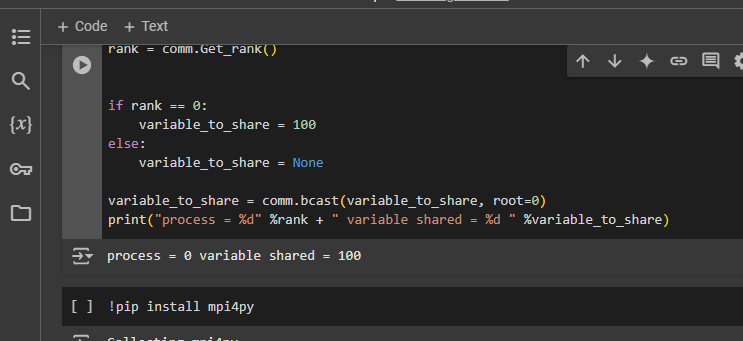

### broadcast
This code utilizes MPI (Message Passing Interface) to broadcast a variable from the root process (rank 0) to all other processes in a parallel computing environment. Initially, Rank 0 assigns a value of 100 to the variable `variable_to_share`, while all other processes set it to None. The `comm.bcast()` function is employed to broadcast this variable from Rank 0 to all processes. After the broadcast, each process prints the value of the shared variable, illustrating how data is disseminated from the root process to all other processes within the MPI communicator.

### deadlock problems
This code illustrates the use of MPI for point-to-point communication, where processes send and receive data. Process 1 transmits data ("a") to process 2, while process 2 sends data ("b") back to process 1. The `recv` and `send` operations facilitate the data transfer between these processes. To avoid errors, the `data_received` variable is initialized for all processes, ensuring it is defined before being accessed. After the communication is complete, each process prints the data it has received.

#### gather 
This Python code showcases the use of MPI's `gather` function to collect data from all processes and aggregate it at the root process (rank 0). Each process computes its own value, calculated as the square of its rank plus one \(((\text{rank} + 1)^2)\). The `gather` function is employed to send this computed data from each process to the root process. After all the data is collected at rank 0, it prints the values received from all other processes. This example illustrates how data from multiple processes can be aggregated and processed at a single root process in a parallel computing environment.

### point to point
In this code, MPI (Message Passing Interface) facilitates communication between processes in a parallel computing environment. The script begins by determining the rank (or ID) of the current process using `comm.rank`. Each rank executes different actions based on its rank:

- Rank 0 sends an integer value (10000000) to Rank 4 using the `send()` method.
- Rank 1 sends a string ("hello") to Rank 8.
- Rank 4 receives the integer from Rank 0 using `recv()` and prints it.
- Rank 8 receives the string from Rank 1 and prints it.

This script illustrates basic point-to-point communication, with different processes sending and receiving data according to their rank. It is important to note that the script assumes the presence of processes at ranks 4 and 8, so it must be executed with at least 9 processes for the communication to function correctly.

### scater
This Python code illustrates the use of MPI's `scatter` function to distribute an array of data from the root process (rank 0) to all other processes in a parallel computing environment. The root process initializes an array called `array_to_share` with 9 elements. The `scatter` function divides the array into chunks, distributing one chunk to each process. Each process receives its portion of the array in the `recvbuf` variable and subsequently prints the data it received. This method enables the root process to efficiently send data to multiple processes, allowing each to work on its assigned portion of the data.
