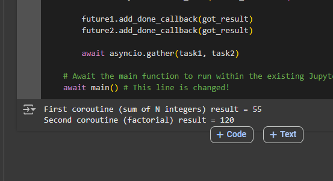
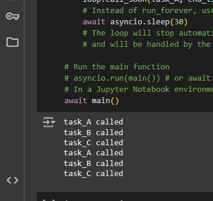
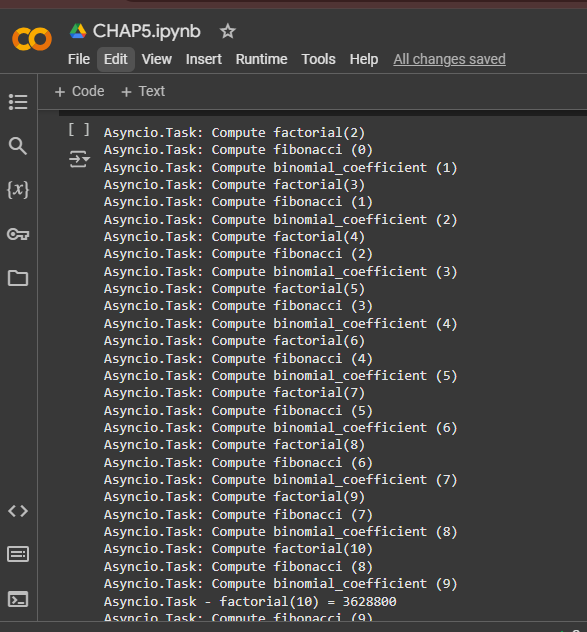
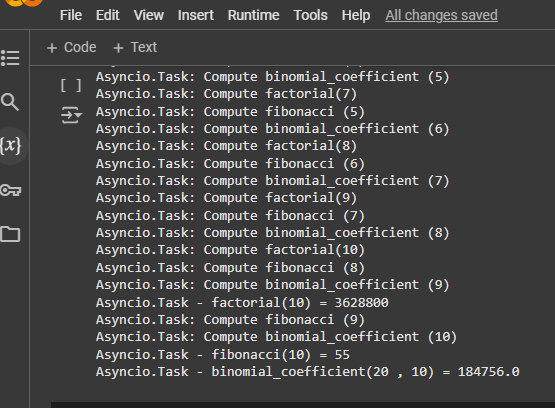
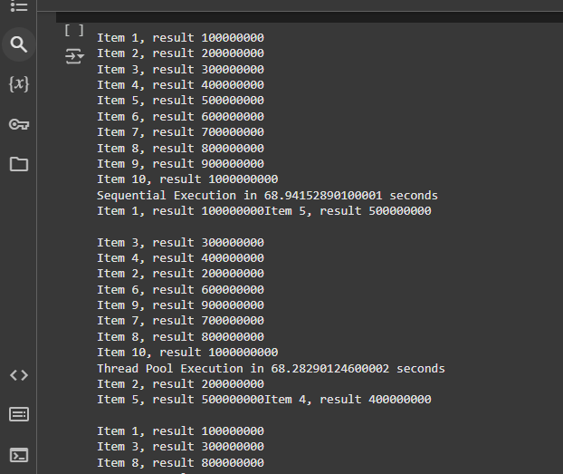
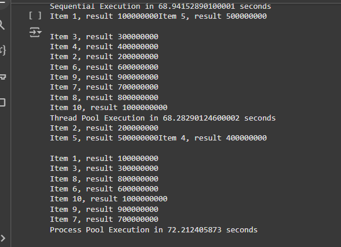

### asyncioCoroutine

This chapter presents examples of asynchronous programming using Python's `asyncio` and `concurrent.futures` modules. It emphasizes understanding the asynchronous execution model, allowing developers to build efficient, single-threaded concurrent applications. Key topics include:

- **Asynchronous Execution**: Exploring how tasks can run concurrently without blocking the main thread, improving responsiveness and performance.
- **asyncio Module**: Demonstrating how to define and run asynchronous functions using `async` and `await` keywords, and managing event loops.
- **concurrent.futures Module**: Illustrating the use of `ThreadPoolExecutor` and `ProcessPoolExecutor` for managing asynchronous tasks and handling parallelism.
  
By leveraging these modules, programmers can create applications that efficiently handle I/O-bound and CPU-bound tasks, enhancing overall application performance.

### asyncioEventloop
### A Deeper Dive into Event Loop Operations

An event loop is a core component of asynchronous programming in Python, particularly when using the `asyncio` module. It manages the execution of asynchronous tasks, allowing for efficient handling of I/O operations without blocking the main thread. Here's a detailed explanation of how event loops operate:

#### 1. **Event Loop Definition**
The event loop is a construct that continuously checks for events, such as I/O operations or timers, and executes the corresponding callbacks. It enables the program to perform other tasks while waiting for an operation to complete.

#### 2. **Initialization**
When an asynchronous program starts, an event loop is created. This loop will run until all tasks are completed. It manages the scheduling of tasks and the execution of their callbacks.

#### 3. **Task Scheduling**
Tasks are scheduled to run on the event loop using `asyncio.create_task()` or `loop.run_until_complete()`. Each task represents a coroutine that can be paused and resumed, allowing other tasks to run in the meantime.

#### 4. **Running Tasks**
The event loop executes tasks in a non-blocking manner. When a task encounters an `await` expression, it yields control back to the event loop, allowing it to run other scheduled tasks. This is crucial for maintaining responsiveness, especially in I/O-bound applications.

#### 5. **Handling I/O Operations**
The event loop efficiently handles I/O operations (like reading from a file or making network requests) by using underlying operating system features. When an I/O operation is initiated, the loop can continue processing other tasks while waiting for the I/O to complete.

#### 6. **Callbacks and Futures**
When a task completes, it may trigger callbacks or return results via `Future` objects. The event loop monitors these `Future` objects and executes any associated callbacks once the task is finished.

#### 7. **Timers and Delays**
The event loop also manages timers, allowing you to schedule tasks to run after a specific delay. This is useful for implementing timeouts or periodic tasks.

#### 8. **Graceful Shutdown**
When all tasks are completed or when the application needs to shut down, the event loop can be closed gracefully. This ensures that all resources are released properly, and no tasks are left hanging.

###  asycniotask
### `manipulating_task.py`: Practical Examples of Task Manipulation Using `asyncio`

The `manipulating_task.py` script serves as an instructional resource that demonstrates various techniques for managing tasks within Python's `asyncio` framework. Below is a detailed explanation of its key concepts and functionalities, followed by a paraphrased summary.

#### 1. **Creating Tasks**
The script showcases how to create and manage asynchronous tasks using `asyncio`. Tasks are created with the `asyncio.create_task()` function, which schedules a coroutine to run concurrently. This allows multiple tasks to execute without blocking each other.

#### 2. **Awaiting Task Completion**
Each task can be awaited using the `await` keyword. This pauses the execution of the current coroutine until the awaited task is completed. This feature is essential for coordinating the flow of asynchronous operations.

#### 3. **Gathering Results**
The script demonstrates the use of `asyncio.gather()` to run multiple tasks concurrently and collect their results. This function takes multiple awaitable objects and returns their results as a list, making it easy to handle outputs from multiple tasks.

#### 4. **Handling Exceptions**
When manipulating tasks, it's crucial to manage exceptions that may arise during their execution. The script illustrates how to use try-except blocks within coroutines to catch and handle exceptions gracefully, ensuring that one failing task does not disrupt others.

#### 5. **Cancelling Tasks**
The ability to cancel tasks is a key feature of `asyncio`. The script shows how to cancel a running task using the `task.cancel()` method. This allows for efficient resource management, especially when certain operations are no longer needed.

#### 6. **Timeouts**
The script may also demonstrate how to impose timeouts on tasks using `asyncio.wait_for()`. This is useful for ensuring that tasks do not run indefinitely, enabling the program to handle potential deadlocks or long-running operations.

#### 7. **Running Tasks Sequentially vs. Concurrently**
It highlights the differences between running tasks sequentially and concurrently. While sequential execution waits for one task to finish before starting the next, concurrent execution allows multiple tasks to progress simultaneously, vastly improving efficiency for I/O-bound operations.

### concurrent features
### `concurrent_futures_pooling.py`: Highlights Pooling Techniques with `concurrent.futures`

The `concurrent_futures_pooling.py` script demonstrates various pooling techniques to manage concurrent execution of tasks using Python’s `concurrent.futures` module. This module simplifies the execution of parallel tasks and is particularly useful for CPU-bound and I/O-bound operations. Below is a detailed explanation of its key concepts and functionalities, followed by a paraphrased summary.

#### 1. **Understanding Thread and Process Pools**
The script typically utilizes two types of pools provided by `concurrent.futures`:

- **ThreadPoolExecutor**: This pool is designed for managing a pool of threads. It is well-suited for I/O-bound tasks, where the program spends time waiting for external resources (like file I/O or network requests). Using threads allows multiple I/O operations to occur simultaneously.

- **ProcessPoolExecutor**: This pool manages a pool of separate processes. It is ideal for CPU-bound tasks, where the program requires significant computation. By utilizing multiple processes, Python can bypass the Global Interpreter Lock (GIL), enabling true parallelism.

#### 2. **Submitting Tasks to the Pool**
The script illustrates how to submit tasks to either pool using the `submit()` method. This method schedules a callable (function) to be executed and returns a `Future` object, which represents the execution of the task. The `Future` object can be used to check the status of the task or retrieve its result once completed.

#### 3. **Using map for Bulk Execution**
The script may also showcase the `map()` method, which is a convenient way to apply a function to a list of inputs. This method blocks until all results are available, making it simple to handle bulk executions without manually managing each task.

#### 4. **Handling Results and Exceptions**
The script emphasizes the importance of managing results from the `Future` objects. It demonstrates how to retrieve results using the `result()` method. Additionally, it shows how to handle exceptions that may occur during task execution, ensuring that errors are caught and handled gracefully.

#### 5. **Shutdown and Cleanup**
Properly shutting down the pool is crucial to releasing resources. The script highlights the `shutdown()` method, which cleans up the executor and waits for the completion of all submitted tasks before terminating the pool.

#### 6. **Performance Considerations**
The script might discuss performance considerations when choosing between threads and processes. It explains scenarios where one might be more efficient than the other based on the nature of the tasks being executed (I/O-bound vs. CPU-bound).

### Paraphrase Summary
The `concurrent_futures_pooling.py` script highlights various pooling techniques using Python's `concurrent.futures` module for concurrent task execution. It explains the use of `ThreadPoolExecutor` for I/O-bound tasks and `ProcessPoolExecutor` for CPU-bound tasks, allowing multiple operations to run in parallel. The script demonstrates how to submit tasks with the `submit()` method, retrieve results from `Future` objects, and use the `map()` method for bulk function applications. It emphasizes the importance of error handling and graceful shutdown of the pool using the `shutdown()` method. Additionally, the script may touch on performance considerations, helping users choose the right type of pool based on the specific nature of their tasks.

